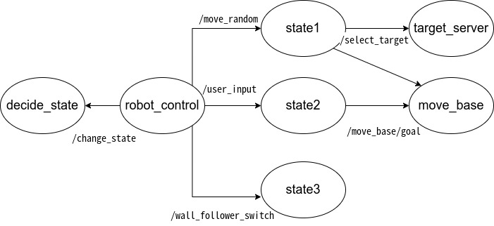
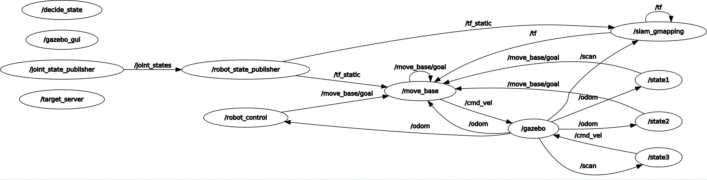
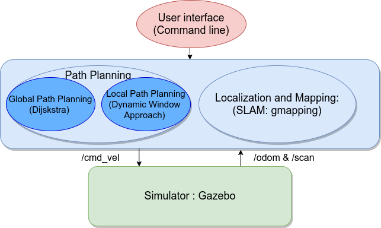

# final_assignment
## OverView

This is the package to simulate the non-holonomic robot by using navigation stack on gazebo environment.

The robot gets the user request, and the robot takes one of the following actions.

1. move randomly in the environment, by choosing 1 out of 6 possible target positions:
   [(-4,-3);(-4,2);(-4,7);(5,-7);(5,-3);(5,1)], implementing a random position service.
2. directly ask the user of the next target position (checking that the position is one of the possible six)
   and reach it
3. start following the external walls
4. stop in the last position

### Description of the content of the package

#### Nodes

- robot_control
- state1
- state2
- state3
- decide_state
- select_target

#### Topic 

- /cmd_vel
  - Type: gemetry_msgs/Twist
  - Publisher Node: robot_control (When state=4), state3
  - Subscriber Node: /gazebo
- /odom
  - Type: nav_msgs/Odometry
  - Publisher Node: /gazebo
  - Subscriber Node: state1, state2, robot_control, move_base
- /move_base/goal
  - Type: MoveBaseActionGoal
  - Publisher : state1, state2, robot_control, move_base
  - Subscriber:/move_base


#### Service

- /change_state
  - Client Node: robot_control
  - Server Node: decide_state
  - Type : SetBool
- /reach_goal
  - Client Node: state1, state2
  - Server Node: robot_control
  - Type: SetBool
- /move_random
  - Client Node: robot_control (When state=1)
  - Server Node: state1
  - Type : SetBool
- /user_input
  - Client Node: robot_control (When state=2)
  - Server Node: state2
  - Type : SetBool
- /wall_follower_switch
  - Client Node: robot_control (When state=3)
  - Server Node: state3
  - Type : SetBool
- /select_target
  - Client Node: state1
  - Server Node : target_server
  - Type : RandomPosition


#### custom service

- final_assignment/RandomPos

  - response

    - float32 x
    
    - float32 y
    
      

#### the robot behaviors implemented


First of all, we describe the role of each main nodes.

- robot_control

  - change the state depending on user's command.

- state1

  -  make the robot move as the state=1.

  - state=1 : move randomly in the environment, by choosing 1 out of 6 possible target positions:

    ​            [(-4,-3);(-4,2);(-4,7);(5,-7);(5,-3);(5,1)], implementing a random position service

- state2

  - make the robot move as the state=2.

  - state=2 : directly ask the user of the next target position

    ​            (checking that the position is one of the possible six)

- state3

  - make the robot move as the state=3.
  - state=3: start following the external walls

- decide_state

  - ask user to decide the new state of the robot when the service "/change_state" is called.
  - make the user requested to choose from the state 1~4.

- select_target

  -  generate the random target position from [(-4,-3),(-4,2),(-4,7),(5,-7),(5,-3),(5,1)] for state=1
  - response and send the the random target position as the client of '/select_target'


Next, we explain the processing flow.

1. Node "robot_control" send the service to node "decide_state" to get the new state of the robot.

2. Node "decide_state" ask user to decide the new state of the robot and response new state to Node "robot_control" 

3.  Node "robot_control" send the service to the node which corresponds with the state.

   - State=1
     1. Node "state1" send the service to node "target_server" to the random target position from [(-4,-3),(-4,2),(-4,7),(5,-7),(5,-3),(5,1)] .
     2. Node "target_server" generate the random target position and response the new target position to Node "state1"
     3. Node "state1" publish this new target position to move_base
   - State2
     1. Node "state2" ask user to input the the random target position from [(-4,-3),(-4,2),(-4,7),(5,-7),(5,-3),(5,1)] .
     2. Node "state2" publish this new target position to move_base.
   - State3
     1. Node "state3"  find the wall and follow them.

   





#### rqt_graph




#### Software architecture

Finally, we explain the complete picture of the architecture.

We decide the robot motion depending on the user input. Depending on this, the robot plan the path to the target position by using global path planning and the robot is moving while avoid obstacle and modify the planned path by using local path planning.

The robot estimate the current position and create the map by slam algorithm (gmapping package) based on particle filter.





## Installation

### Dependencies

This software is built on the Robotic Operating System ([ROS]), which needs to be install first and create the workspace. 

- Ros Kinetic
- gazebo 7.0.0


### Building

This package use ros navigation_stack.

In order to install this,

```
sudo apt-get install ros-<your_ros_distro>-navigation
```


Install this package and the other necessary package into your workspace.

 Compile the package using ROS.

```
cd catkin_workspace/src
git clone https://github.com/n-shintaro/final_assignment.git
git clone https://github.com/CarmineD8/slam_gmapping.git
cd ../
catkin_make
```


## Usage

```
roscore &
```

To launch move_base.launch and simulation_gmapping,

```
roslaunch final_assignment depedency.launch
```

To launch the file which is the main file to command the robot,

```
roslaunch final_assignment final_assignment.launch
```

If you have an error like "can't find final assignment package",
```
source devel/setup.bash
```


## 　Conclusion and Further investigation

We describe system’s limitations and possible improvements.

Move_base package provides us a lot of topic (reference: http://wiki.ros.org/move_base). For example, "move_base/status"  provides status information on the goals that are sent to the move_base action. If status==3, it means that the goal was achieved successfully. In my case, when I judge whether the robot reach the goal, I calculate the distance between the target position and the current position. But if I use this topic, I can judge more easily and correctly. And In my case, when I judge whether the robot reaches the goal, we don't consider the angle of orientation. I can improve like below. After distance between the target position and the current position is lower than the threshold, we can set the threshold for the angle of orientation and make the robot rotate on the spot. 

My code has a mistake that when state is changed from 1 (or 2) to 3 (follow the wall) , move_base, state3 node publishes cmd_vel. But move_base still publishes cmd_vel in order to go to the target position which was set before. In order to remove the previous target position, I found the websites which say that the topic "/move_base/cancel" and actionlib can cancel the goal.

SLAM algorithm create the mapping while moving and estimating the current position. Therefore, at the beginning, there are possibility the robot plan the path which cannot be passed through.
So If we already know the map, it is better to use amcl which estimate the current position by pattern matching with pre-existing maps and laser data. In this case, the robot already know the environment so it can solve this issue.  We already created the map data (saved in the "map" folder) so I want to use amcl, too.

The robot plan the path by Dijsksta but this algorithm explore all of the possible grid node. So it takes a long time to calculate when there are a lot of nodes. There is the other algorithm called A* which use heuristics so this calculate faster than Dijskstra.

In this environment, there are not dynamic obstacle like humans but our algorithm is not suitable for moving in the dynamic environment. Dynamic obstacle is moving unlike static obstacle so they cannot be written on the map. So the robot detect the position of dynamic obstacle and predict the motion of dynamic obstacle in real time. Further improvement and studies are needed in order for the robot to move in the dynamic environment.
